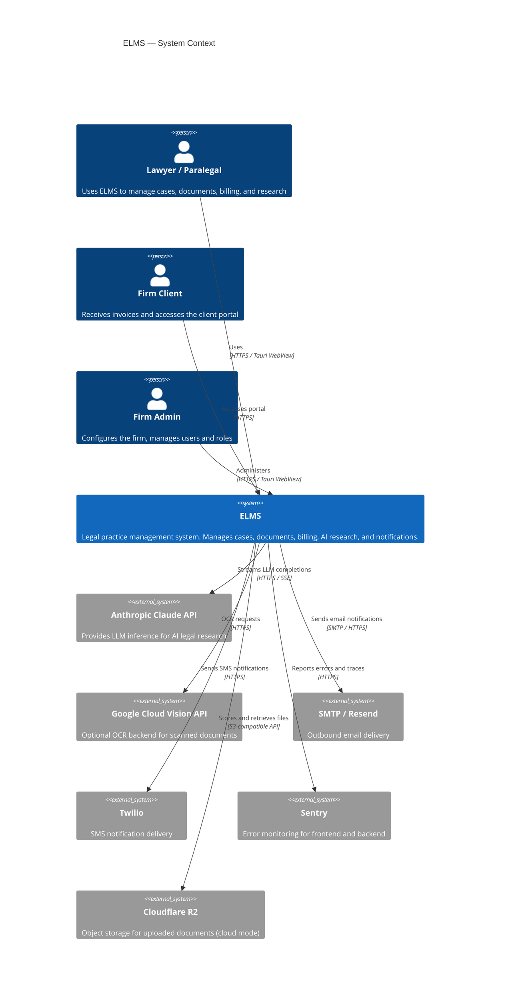
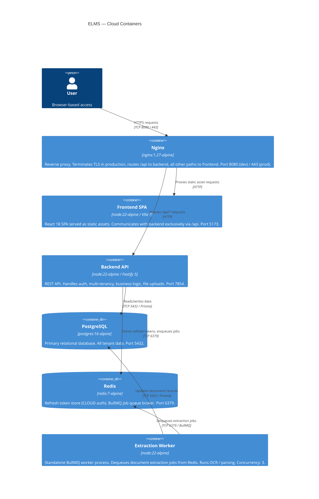
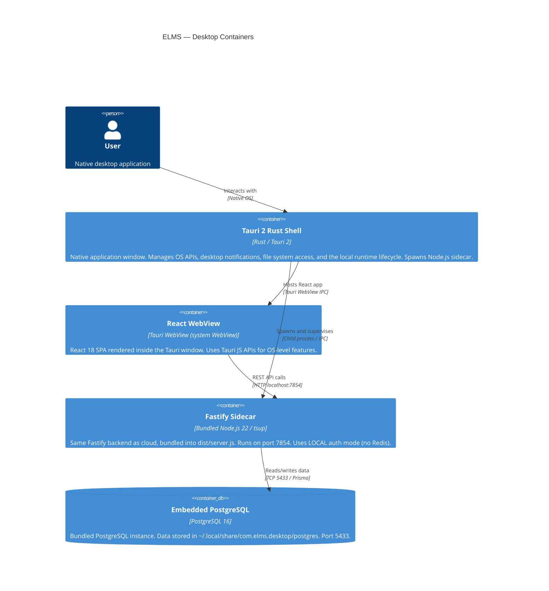

# ELMS Architecture — 01: System Overview

## 1. Introduction

ELMS (Electronic Legal Management System) is a multi-tenant legal practice management platform designed for Egyptian and MENA law firms. It is delivered in two distinct deployment topologies that share a single codebase:

- **Cloud deployment**: Docker-based, internet-connected, multi-firm SaaS model.
- **Desktop deployment**: Tauri 2 packaged native application, fully offline-capable, single-firm per installation.

The system is structured as a pnpm monorepo with three packages:

| Package | Role |
|---|---|
| `@elms/backend` | Fastify 5 REST API, business logic, Prisma ORM |
| `@elms/frontend` | React 18 SPA, TanStack Router, TanStack Query |
| `@elms/shared` | TypeScript types, enums, Zod schemas shared across packages |

---

## 2. C4 Level 1 — System Context Diagram

---

## 3. C4 Level 2 — Container Diagrams

### 3.1 Cloud Deployment Containers

### 3.2 Desktop Deployment Containers

---

## 4. Cloud vs. Desktop Deployment — Narrative Comparison

### 4.1 Networking and Serving

In the **cloud** topology, Nginx acts as the single external entry point. It terminates TLS (via certbot in production), serves frontend static assets, and reverse-proxies all `/api/*` requests to the Fastify backend. The frontend and backend run as separate Docker containers; they never communicate directly outside of the Nginx proxy.

In the **desktop** topology, there is no web server. The Tauri 2 Rust shell spawns a bundled Node.js process (the Fastify sidecar) on `localhost:7854`. The React frontend is loaded directly into the system's WebView engine and calls the sidecar over localhost. No external network access is required for normal operation.

### 4.2 Authentication

The cloud deployment uses **CLOUD auth mode**: RS256 JWT access tokens (15-minute TTL) stored in an `HttpOnly` cookie, backed by UUID refresh tokens persisted in Redis (30-day TTL).

The desktop deployment uses **LOCAL auth mode**: an in-memory session stored in the `elms_local_session` cookie (12-hour TTL). Redis is not required or present.

### 4.3 Storage

Cloud mode uses either the **local filesystem** adapter (for development/testing) or the **Cloudflare R2** adapter for production file storage. The `STORAGE_DRIVER` environment variable selects between them.

Desktop mode always uses the **local filesystem** adapter, writing files relative to `LOCAL_STORAGE_PATH`.

### 4.4 Document Extraction

Cloud mode enqueues extraction jobs into a BullMQ queue backed by Redis. A separate worker process dequeues and processes them at concurrency 3.

Desktop mode runs extraction inline, via `setImmediate`, after the HTTP response is returned to the client. No Redis or separate worker process is involved. See [`extractionDispatcher.ts`](../../packages/backend/src/jobs/extractionDispatcher.ts).

### 4.5 Database

Cloud mode connects to a Docker-managed PostgreSQL 16 instance on port 5432 (`elms_cloud` database).

Desktop mode connects to a bundled PostgreSQL 16 instance on port **5433** (deliberately offset to avoid conflicts with any system-level PostgreSQL). Data is persisted under `~/.local/share/com.elms.desktop/postgres`.

### 4.6 Licensing

Cloud mode uses subscription-based edition tiers managed in the `Firm` database record (`editionKey`).

Desktop mode no longer blocks startup on a local `elms.license` file. Server-side licensing data still exists for edition and lifecycle logic, but desktop launch is gated by local runtime health only. Desktop upgrades are currently distributed as full installers rather than OTA updates.

### 4.7 System Boundaries

| Boundary | Cloud | Desktop |
|---|---|---|
| External network required | Yes (auth, R2, AI, email, SMS) | No (offline capable) |
| Multi-firm | Yes (multi-tenant, firmId partitioned) | No (single firm per install) |
| TLS termination | Nginx + certbot | Not applicable |
| Redis | Required | Not present |
| BullMQ worker | Separate process | Inline (`setImmediate`) |
| PostgreSQL port | 5432 | 5433 |

---

## 5. Backend Module Overview

The `packages/backend/src/modules/` directory contains one subdirectory per domain module. Modules
planned for upcoming phases are listed as _planned_.

| Module | Status | Purpose |
|--------|--------|---------|
| `auth/` | Shipped | Authentication and session management |
| `billing/` | Shipped | Invoices, payments, expenses |
| `billing/eta/` | Planned (Phase 12) | ETA e-invoicing pipeline — `IETAAdapter`, builders, BullMQ queue |
| `cases/` | Shipped | Case lifecycle, parties, assignments, status history |
| `clients/` | Shipped | Client CRM, contacts, portal access |
| `company-formation/` | Planned (Phase 9) | Company formation module — formations, fee items, status history |
| `documents/` | Shipped | Upload, OCR, versioning, full-text search |
| `documents/ocr/` | Shipped + extending | `VlmOcrAdapter` added in Phase 14 alongside existing adapters |
| `editions/` | Shipped | Edition policy, lifecycle scheduler, license validation |
| `hearings/` | Shipped | Court sessions, scheduling, outcomes |
| `integrations/moj/` | Planned (Phase 17) | MoJ/State Council portal adapter stubs |
| `invitations/` | Shipped | Invite flow for cloud onboarding |
| `library/` | Shipped | Law Library — documents, categories, annotations |
| `lookups/` | Shipped | Firm-customizable lookup tables |
| `notifications/` | Shipped | Dispatch hub, channel implementations |
| `notifications/channels/whatsapp.ts` | Planned (Phase 13) | WhatsApp via Meta Cloud API |
| `portal/` | Shipped + extending | Client portal — auth, views, appointment requests (Phase 10) |
| `reports/` | Shipped + extending | Analytics and exports; new reports in Phase 11 |
| `research/` | Shipped | AI Research — RAG, SSE streaming, sessions, citations |
| `roles/` | Shipped | Role and permission management |
| `tasks/` | Shipped | Task lifecycle, assignments |
| `templates/` | Shipped | Document template generation |
| `users/` | Shipped | User management |

### External System Dependencies (Planned Phases)

| External System | Phase | Env Vars |
|----------------|-------|---------|
| Meta WhatsApp Business API | 13 | `WHATSAPP_PROVIDER`, `WHATSAPP_PHONE_NUMBER_ID`, `WHATSAPP_ACCESS_TOKEN`, `WHATSAPP_TEMPLATE_NAMESPACE` |
| OpenAI / Gemini (VLM OCR) | 14 | `VLM_PROVIDER`, `VLM_API_KEY` |
| Egyptian Tax Authority (ETA) | 12 | `ETA_ADAPTER_TYPE`, `ETA_MIDDLEWARE_API_KEY`, `ETA_TAX_REGISTRATION_NUMBER` |
| Digital Egypt portal | 16 | None (browser link only — no server-side integration) |
| MoJ / State Council portal | 17 | TBD (blocked on government API access) |

---

## 6. Related Documents

- [02-tech-stack-rationale.md](./02-tech-stack-rationale.md) — Why each technology was selected
- [03-data-flow.md](./03-data-flow.md) — Authenticated request lifecycle
- [06-deployment-topologies.md](./06-deployment-topologies.md) — Full environment-variable and service configuration per topology
- [08-product-roadmap.md](../business/08-product-roadmap.md) — Phase-by-phase implementation plan
