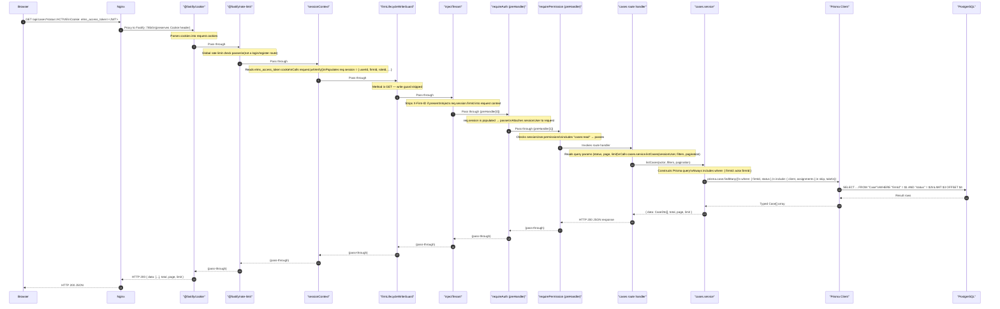
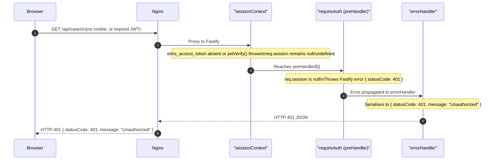
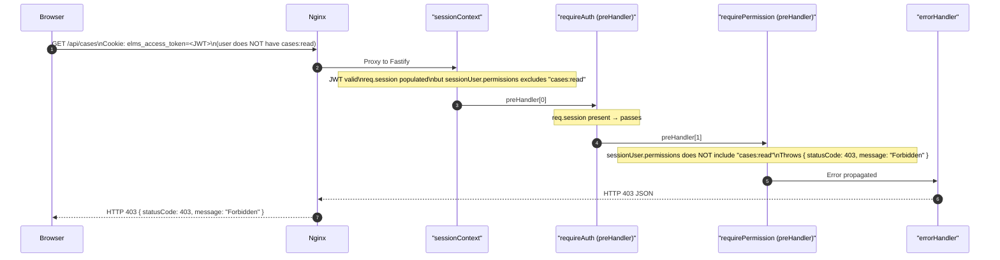
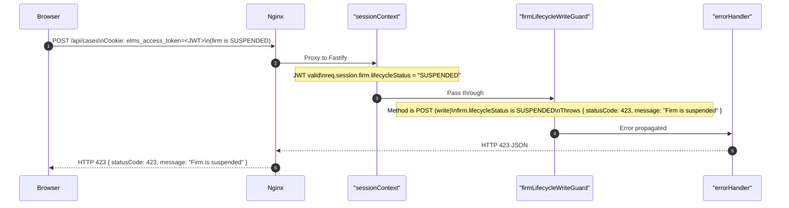
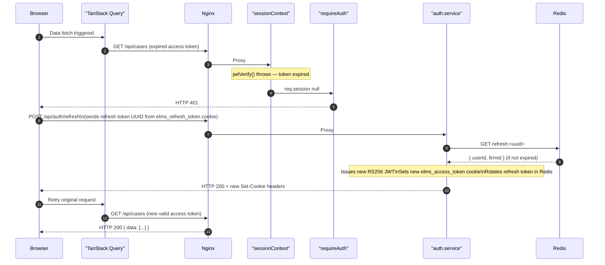

# ELMS Architecture — 03: Data Flow

This document traces the complete request lifecycle through the ELMS stack, using `GET /api/cases` as a representative authenticated read request. It covers both the happy path (authenticated, authorised) and the two main failure paths (unauthenticated, unauthorised).

---

## 1. Plugin Registration Order

Before tracing requests, it is important to understand the order in which Fastify plugins are registered in `app.ts`. Every incoming request passes through these layers in sequence:

| Order | Plugin | Purpose |
|---|---|---|
| 1 | `@fastify/cookie` | Parses `Cookie` header into `request.cookies` |
| 2 | `@fastify/cors` | Sets CORS headers, rejects disallowed origins |
| 3 | `@fastify/rate-limit` | Enforces per-route and global rate limits |
| 4 | `@fastify/multipart` | Parses multipart form data (max 50 MB) |
| 5 | `@fastify/jwt` | Registers `request.jwtVerify()` using RS256 |
| 6 | `sessionContext` | Decodes `elms_access_token` (CLOUD) or `elms_local_session` (LOCAL) into `req.session` |
| 7 | `firmLifecycleWriteGuard` | Blocks write methods (POST/PUT/PATCH/DELETE) on SUSPENDED or PENDING_DELETION firms with HTTP 423 |
| 8 | `errorHandler` | Catches all unhandled errors, serialises them into a consistent JSON response |
| 9 | `injectTenant` | Strips `X-Firm-ID` from external requests; injects `firmId` from `req.session` into every request context |

Route-level `preHandler` hooks (`requireAuth`, `requirePermission`) run after all global plugins, immediately before the route handler.

---

## 2. Happy Path — Authenticated GET /api/cases

---

## 3. Unauthenticated Path — Missing or Expired Token

---

## 4. Authorisation Failure Path — Missing Permission

---

## 5. Write Request — firmLifecycleWriteGuard Blocking Path

---

## 6. Token Refresh Flow (CLOUD Mode)

When the `elms_access_token` JWT has expired (15-minute TTL) but a valid refresh token exists in Redis, the frontend initiates a silent refresh before retrying the original request.

---

## 7. Key Design Points

**firmId is always injected, never trusted from the client.** The `injectTenant` plugin strips any `X-Firm-ID` header that arrives from outside (e.g., a forged request). The `firmId` that reaches every service function comes exclusively from the validated session token.

**Permission strings follow `resource:action` format.** The `requirePermission` middleware receives a string like `"cases:read"` and checks it against `sessionUser.permissions`, which is an array of strings loaded at session decode time. See [04-auth-and-security.md](./04-auth-and-security.md) for the full RBAC model.

**Error serialisation is centralised.** All thrown errors pass through the `errorHandler` plugin. Route handlers and services throw typed Fastify HTTP errors; the handler maps them to consistent `{ statusCode, message, code? }` JSON objects. Stack traces are never sent to clients in production.

**Multi-tenancy at the Prisma layer.** Even if a bug in a middleware layer allowed `firmId` to be spoofed, every `prisma.entity.findMany` call in the service layer includes `where: { firmId: actor.firmId }`. Cross-firm data leakage requires bypassing both the middleware and the ORM query construction.

---

## Related Documents

- [01-system-overview.md](./01-system-overview.md) — Container diagram showing Nginx → Backend → PostgreSQL
- [04-auth-and-security.md](./04-auth-and-security.md) — JWT keys, cookie settings, RBAC model
- [05-multi-tenancy.md](./05-multi-tenancy.md) — firmId enforcement and lifecycle guard detail

## Source of truth

- `docs/_inventory/source-of-truth.md`

