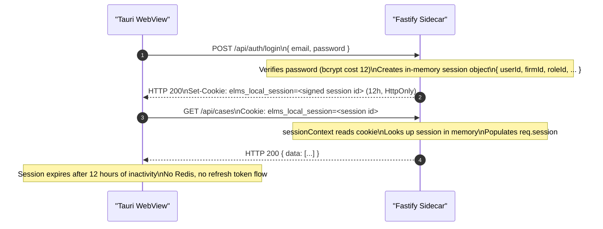

# ELMS Architecture — 04: Authentication and Security

---

## 1. Authentication Modes Overview

ELMS supports two authentication modes, selected at startup via the `AUTH_MODE` environment variable:

| Mode | Use Case | Token Storage | Redis Required |
|---|---|---|---|
| `CLOUD` | Multi-tenant SaaS, internet-connected | RS256 JWT (access) + UUID refresh token in Redis | Yes |
| `LOCAL` | Single-firm desktop (Tauri), offline-capable | In-memory session in signed cookie | No |

---

## 2. CLOUD Mode — JWT RS256 Token Flow

### 2.1 Key Pair

ELMS uses the **RS256** algorithm (RSA-PKCS1-v1_5 with SHA-256) for JWT signing. This asymmetric scheme allows the public key to be distributed (e.g., to a separate resource service) without exposing the private signing key.

- **Development**: Key pair is auto-generated on first startup and written to a local file. This avoids configuration burden during local development.
- **Production**: `JWT_PRIVATE_KEY` and `JWT_PUBLIC_KEY` environment variables **must** be set to PEM-encoded values. Startup fails if they are absent in production.

**Key rotation procedure:**
1. Generate a new RSA-2048 key pair.
2. Set the new `JWT_PRIVATE_KEY` and `JWT_PUBLIC_KEY` in the environment.
3. Restart backend instances. New tokens are signed with the new key immediately.
4. Existing access tokens (15-minute TTL) will naturally expire. Refresh tokens remain valid in Redis until their 30-day TTL expires; the refresh endpoint will re-issue access tokens signed with the new key.
5. No forced logout is required unless the old private key is compromised.

### 2.2 Token Lifecycle

```mermaid
sequenceDiagram
    autonumber
    participant Browser
    participant Backend
    participant Redis

    Browser->>Backend: POST /api/auth/login\n{ email, password }
    Note over Backend: Verifies password (bcrypt cost 12)\nChecks user.status = ACTIVE

    Backend->>Redis: SET refresh:<uuid> { userId, firmId } EX 2592000\n(30 days TTL)

    Backend-->>Browser: HTTP 200\nSet-Cookie: elms_access_token=<JWT> (15 min, HttpOnly)\nSet-Cookie: elms_refresh_token=<uuid> (30 days, HttpOnly)

    Note over Browser: Uses access token for all API calls

    Browser->>Backend: GET /api/cases\nCookie: elms_access_token=<JWT>
    Note over Backend: jwtVerify() succeeds → serve response

    Note over Browser: Access token expires after 15 min

    Browser->>Backend: POST /api/auth/refresh\nCookie: elms_refresh_token=<uuid>
    Backend->>Redis: GET refresh:<uuid>
    Redis-->>Backend: { userId, firmId }

    Note over Backend: Issues new JWT\nRotates refresh token (old UUID deleted, new UUID stored)

    Backend-->>Browser: HTTP 200\nSet-Cookie: elms_access_token=<new JWT>\nSet-Cookie: elms_refresh_token=<new uuid>

    Browser->>Backend: POST /api/auth/logout
    Backend->>Redis: DEL refresh:<uuid>
    Backend-->>Browser: HTTP 200\nSet-Cookie: elms_access_token=; Max-Age=0\nSet-Cookie: elms_refresh_token=; Max-Age=0
```

### 2.3 Access Token Claims

The JWT payload contains the minimum claims needed to reconstruct the session without a database round-trip on every request:

```json
{
  "sub": "<userId>",
  "firmId": "<firmId>",
  "roleId": "<roleId>",
  "iat": 1234567890,
  "exp": 1234568790
}
```

The `sessionContext` plugin decodes these claims and attaches them to `req.session`. Permission strings are loaded from the database at session decode time and attached to `req.sessionUser.permissions`.

---

## 3. LOCAL Mode — In-Memory Session Flow



**Key differences from CLOUD mode:**
- No Redis dependency: sessions are held entirely in the Fastify process memory.
- Single-process model: the desktop app runs one Fastify sidecar; there is no session sharing concern.
- Simpler logout: the session object is removed from memory and the cookie is cleared.
- 12-hour TTL is appropriate for a single-user desktop application session.

---

## 4. Cookie Security

All authentication cookies are set with the following attributes:

| Attribute | Value | Purpose |
|---|---|---|
| `HttpOnly` | `true` | Prevents JavaScript access; mitigates XSS token theft |
| `SameSite` | `lax` | Prevents CSRF in most contexts while allowing top-level navigation |
| `Secure` | `true` in production | Ensures cookies are only sent over HTTPS |
| `Domain` | `COOKIE_DOMAIN` env var | Scopes cookie to the correct domain in production |
| `Path` | `/` | Cookie sent on all requests to the domain |

**`SameSite=lax`** is chosen over `strict` because `strict` breaks OAuth/SSO redirect flows and bookmark navigation. `lax` still protects against CSRF for state-mutating requests (POST, PUT, DELETE) which require `SameSite: none` to be sent cross-site — they won't be.

---

## 5. RBAC Model

### 5.1 Schema Entities

```
Permission (id, key: string)          e.g. "cases:read", "invoices:create"
Role (id, firmId?, key, name, scope: SYSTEM | FIRM)
RolePermission (roleId, permissionId)
User (id, firmId, roleId, ...)
```

- `SYSTEM` roles are defined at install time and apply to all firms (e.g., `admin`, `lawyer`, `paralegal`).
- `FIRM` roles are created by firm administrators and are scoped to a single firm.
- Every user is assigned exactly one role via `roleId`.

### 5.2 Permission String Format

Permissions follow the pattern `resource:action`:

| Permission | Meaning |
|---|---|
| `cases:read` | List and view cases |
| `cases:create` | Create new cases |
| `cases:update` | Edit case metadata |
| `cases:delete` | Archive/delete cases |
| `documents:read` | View and download documents |
| `documents:create` | Upload documents |
| `invoices:read` | View invoices |
| `invoices:create` | Issue invoices |
| `users:manage` | Invite, suspend, and manage users |
| `roles:manage` | Create and assign firm-scoped roles |

### 5.3 Enforcement Chain

```
requireAuth → populates req.sessionUser (includes permissions[])
requirePermission("cases:read") → checks req.sessionUser.permissions.includes("cases:read")
```

Permissions are loaded from the database at session decode time:

```
User → Role → RolePermission → Permission.key
```

The array of permission key strings is cached in the session (JWT claim or in-memory session object) to avoid a database query on every request.

### 5.4 RBAC Flow Diagram

```mermaid
flowchart TD
    A[User logs in] --> B[Load Role from DB]
    B --> C[Load RolePermissions → Permissions]
    C --> D[Embed permissions[] in session/JWT]
    D --> E[Request arrives]
    E --> F[requireAuth: verify session]
    F --> G{session valid?}
    G -- No --> H[HTTP 401 Unauthorized]
    G -- Yes --> I[requirePermission check]
    I --> J{permission in\nsessionUser.permissions?}
    J -- No --> K[HTTP 403 Forbidden]
    J -- Yes --> L[Route handler executes]
    L --> M[Service: always filters by firmId]
```

---

## 6. Rate Limiting

Rate limits are applied by the `@fastify/rate-limit` plugin, registered globally at plugin level 3 in the startup sequence.

| Endpoint | Limit | Window | Rationale |
|---|---|---|---|
| `POST /api/auth/login` | 10 requests | 1 minute | Brute-force protection |
| `POST /api/auth/register` | 5 requests | 1 minute | Prevents automated firm creation |
| All other routes | Configurable global limit | Per `RATE_LIMIT_*` env vars | General API protection |

Rate limit keys are based on the client IP address. In production behind Nginx, the `X-Forwarded-For` header is used if `TRUST_PROXY=true` is set.

---

## 7. CORS Configuration

CORS is handled by `@fastify/cors` (plugin level 2). The allowed origins are controlled by the `ALLOWED_ORIGINS` environment variable, which accepts a comma-separated list of origins:

```
ALLOWED_ORIGINS=https://app.elms.example.com,https://admin.elms.example.com
```

- In development, `ALLOWED_ORIGINS=*` is set in the Docker Compose environment.
- In production, only explicitly listed origins receive CORS headers.
- Credentials (`withCredentials: true`) are required for cookie-based auth; the CORS plugin sets `credentials: true` when a matching origin is found.

The Tauri desktop WebView does not use CORS (it communicates over localhost), but the Fastify CORS plugin is still registered for consistency.

---

## 8. Content Security Policy — Tauri Desktop

In the Tauri desktop application, Content Security Policy is enforced at the Rust shell level via `tauri.conf.json` capabilities, not HTTP headers. This is more robust than HTTP-level CSP because it restricts what the WebView can do at the OS / process level.

Configured capability restrictions include:
- Which Tauri commands the WebView JavaScript is allowed to invoke (explicit allowlist in `capabilities`).
- File system access restricted to specific paths (app data directory, document uploads).
- Network access restricted to `localhost:7854` for API calls and the OTA update manifest URL.
- No arbitrary `shell` execution from the WebView.

In cloud mode, standard HTTP `Content-Security-Policy` headers are set by Nginx.

---

## 9. firmLifecycleWriteGuard

This plugin is registered at position 7 in the startup sequence, after `sessionContext` has populated `req.session`.

**What it blocks:**
- All HTTP methods that mutate state: `POST`, `PUT`, `PATCH`, `DELETE`
- Triggered when `req.session.firm.lifecycleStatus` is `SUSPENDED` or `PENDING_DELETION`

**Response:**
```json
HTTP 423 Locked
{ "statusCode": 423, "message": "Firm is suspended" }
```

**What it allows through:**
- `GET` and `HEAD` requests (read-only)
- `OPTIONS` requests (CORS preflight)
- The lifecycle itself is immutable once `PENDING_DELETION` is set — only a platform admin can reverse it

See [05-multi-tenancy.md](./05-multi-tenancy.md) for the full firm lifecycle state machine.

---

## 10. Password Policy

- Algorithm: **bcrypt** with cost factor **12**
- Minimum length and complexity requirements are enforced at the Zod schema validation layer on registration and password-change routes
- Passwords are never stored in plaintext, logs, or JWT claims
- Password reset uses a time-limited, single-use token (not detailed here as it is implementation-specific)

bcrypt cost 12 was chosen as the balance between security (resistant to GPU brute-force) and latency (~300 ms on a modern server). This is acceptable for a synchronous login endpoint rate-limited to 10 req/min.

---

## 11. Sentry Error Monitoring

Both the frontend (`@elms/frontend`) and the backend (`@elms/backend`) initialise Sentry with their respective DSN values from environment variables (`SENTRY_DSN`).

**Backend Sentry integration:**
- Initialised before Fastify starts
- Captures unhandled exceptions and promise rejections
- Fastify's `errorHandler` plugin explicitly captures errors via `Sentry.captureException()` before serialising the response
- PII scrubbing: cookie values and `Authorization` headers are excluded from Sentry payloads in production

**Frontend Sentry integration:**
- Initialised in the React app entry point
- Captures unhandled React errors via the Sentry React ErrorBoundary
- Session replay is disabled in the desktop build (no external network assumptions)
- `VITE_SENTRY_DSN` environment variable; empty string disables Sentry entirely (desktop offline builds)

---

## Related Documents

- [03-data-flow.md](./03-data-flow.md) — How auth plugins fit into the request lifecycle
- [05-multi-tenancy.md](./05-multi-tenancy.md) — firmId injection, firm lifecycle, write guard detail
- [06-deployment-topologies.md](./06-deployment-topologies.md) — Environment variables for JWT keys, CORS, cookie domain per topology

## Source of truth

- `docs/_inventory/source-of-truth.md`

