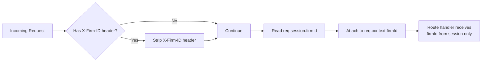
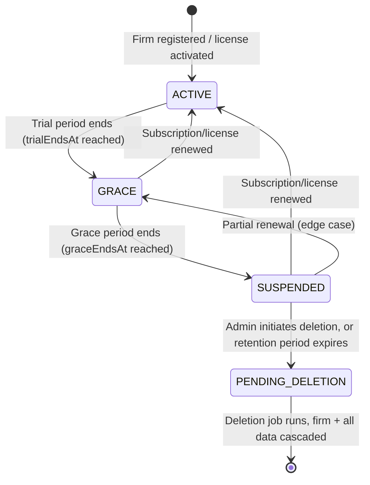
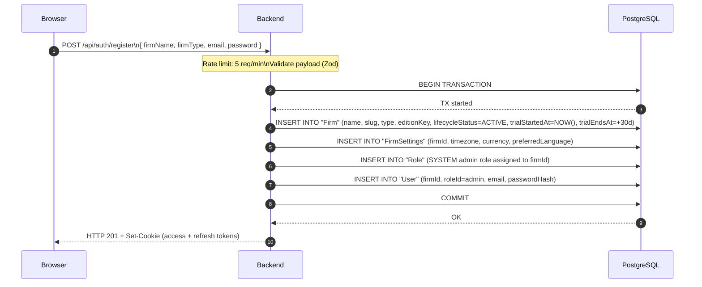
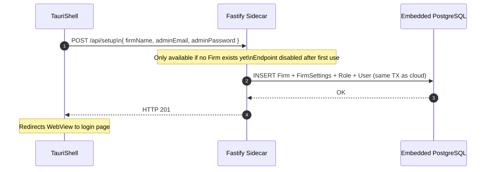

# ELMS Architecture — 05: Multi-Tenancy

---

## 1. Tenancy Model Overview

ELMS uses a **shared database, shared schema** multi-tenancy model. All firms share a single PostgreSQL database and schema. Tenant isolation is enforced by a `firmId` UUID foreign key on every domain entity, not by separate schemas or databases.

This model was chosen because:
- Embedded PostgreSQL on the desktop cannot easily host multiple databases.
- A single schema simplifies migrations (one `prisma migrate deploy` command affects all tenants atomically).
- Operational costs are lower (one backup, one connection pool, one Prisma Client instance).

The trade-off — that a bug could theoretically expose cross-firm data — is mitigated by two independent layers of enforcement: the `injectTenant` middleware and the Prisma service layer. Both must fail simultaneously for a cross-firm data leak to occur.

---

## 2. Database Schema — firmId Foreign Key Pattern

Every domain entity table follows this pattern:

```prisma
model Case {
  id       String   @id @default(uuid())
  firmId   String
  firm     Firm     @relation(fields: [firmId], references: [id], onDelete: Cascade)
  // ... other fields
}
```

The `onDelete: Cascade` constraint ensures that when a `Firm` record is deleted (the final step of the `PENDING_DELETION` lifecycle), all associated data is atomically removed by the database engine — no application-level cleanup loop is required.

**Entities with firmId:**

| Entity | Notes |
|---|---|
| `User` | Scoped to firm; `roleId` references a firm or system Role |
| `Role` | `firmId` is nullable — null means a SYSTEM role shared across all firms |
| `Client` | Individual, company, or government client |
| `Case` | + CaseCourt, CaseSession, CaseAssignment, CaseParty |
| `Document` | May reference a caseId and/or clientId within the same firm |
| `Invoice` | + InvoiceLineItem |
| `Notification` | + NotificationPreference (by userId) |
| `LegalCategory` | Hierarchical taxonomy; explicit `nameAr` + `nameEn` + `nameFr` fields |
| `LibraryDocument` | `firmId` nullable — null means SYSTEM scope (visible to all firms); single `title` field |
| `ResearchSession` | + ResearchMessage, ResearchSessionSource |
| `FirmSettings` | One-to-one with Firm |

---

## 3. injectTenant Middleware

The `injectTenant` plugin is registered at position 9 in the Fastify plugin chain (after `sessionContext` has decoded the token and after `firmLifecycleWriteGuard` has run).

**Responsibilities:**

1. **Strip `X-Firm-ID` from external requests.** Any `X-Firm-ID` header arriving from outside the system is removed before it can influence request processing. This prevents a client from spoofing a different firm's ID.

2. **Inject `firmId` from the session.** The `firmId` decoded from the JWT (CLOUD mode) or in-memory session (LOCAL mode) is attached to the request context. Service functions receive `firmId` through the `sessionUser` object — they never read it from request headers or query parameters.



**Why this matters:** Without stripping `X-Firm-ID`, a user with a valid JWT for firm A could set `X-Firm-ID: <firm-B-id>` and potentially access firm B's data if any route handler naively read the header. The middleware eliminates this attack vector at the framework level.

---

## 4. Multi-Tenancy Enforcement at the Prisma Layer

Even if `injectTenant` were bypassed (e.g., in a unit test with mocked middleware), cross-firm access is blocked at the service layer because every `findMany` and `findUnique` call includes the actor's `firmId` in the `where` clause:

```typescript
// Example from cases.service.ts (representative pattern)
return prisma.case.findMany({
  where: {
    firmId: actor.firmId,   // always injected from session
    ...(filters.status && { status: filters.status }),
  },
  include: { client: true, assignments: { include: { user: true } } },
  skip: pagination.skip,
  take: pagination.limit,
});
```

This pattern is applied consistently across all service functions. A `findUnique` that returns a record belonging to a different firm returns `null`, which the service treats as a 404 — the caller never learns that the record exists.

---

## 5. Firm Lifecycle State Machine

Each firm has a `lifecycleStatus` field that progresses through defined states. Transitions are managed by the edition lifecycle scheduler (node-cron, runs daily).



**State meanings:**

| State | Reads Allowed | Writes Allowed | Notes |
|---|---|---|---|
| `ACTIVE` | Yes | Yes | Normal operation |
| `GRACE` | Yes | Yes | Trial expired; firm can still operate but is warned |
| `SUSPENDED` | Yes | **No** | `firmLifecycleWriteGuard` returns HTTP 423 on all write methods |
| `PENDING_DELETION` | Yes | **No** | Same write block; deletion job scheduled |

**Key fields on the `Firm` model:**

```prisma
trialStartedAt   DateTime?
trialEndsAt      DateTime?   // when ACTIVE → GRACE transition fires
graceEndsAt      DateTime?   // when GRACE → SUSPENDED transition fires
lifecycleStatus  FirmLifecycleStatus @default(ACTIVE)
```

The daily cron job queries all firms where `trialEndsAt < NOW()` and `lifecycleStatus = ACTIVE`, then transitions them to `GRACE`. A second pass transitions `graceEndsAt < NOW()` and `lifecycleStatus = GRACE` to `SUSPENDED`.

---

## 6. Edition Tiers

The `editionKey` field on the `Firm` model references one of five defined edition tiers:

| Edition Key | Deployment | Connectivity | Target Customer |
|---|---|---|---|
| `solo_offline` | Desktop | Offline | Solo practitioner, no internet |
| `solo_online` | Desktop or Cloud | Online | Solo practitioner with cloud features |
| `local_firm_online` | Desktop | Online | Small firm using desktop app with cloud sync |
| `local_firm_offline` | Desktop | Offline | Small firm, fully offline |
| `enterprise` | Cloud | Online | Medium/large firm, full feature set |

Edition-gated features (AI research, SMS notifications, multi-user management) are enforced in service functions by checking `actor.firm.editionKey` against an edition capability map.

The AI research monthly limit (`AI_MONTHLY_LIMIT` env var) is checked at query time:

```
Count ResearchMessage WHERE firmId = $1 AND role = USER AND createdAt > start_of_month
→ if count >= limit → HTTP 429
```

---

## 7. FirmSettings

Each firm has a one-to-one `FirmSettings` record that stores locale and financial preferences:

```prisma
model FirmSettings {
  firmId            String   @id
  timezone          String   @default("Africa/Cairo")
  currency          String   @default("EGP")
  preferredLanguage String   @default("ar")
  // ... other settings
}
```

These settings affect:
- **timezone**: cron-based hearing reminders use firm timezone to calculate "tomorrow" and "today" relative to the firm's locale
- **currency**: invoice totals are formatted in the firm's currency (`EGP` by default for Egyptian firms)
- **preferredLanguage**: the frontend `i18next` locale is initialised from this value on login; Arabic (`ar`) is the default

---

## 8. Firm Creation Flows

### 8.1 CLOUD Mode — Registration



### 8.2 LOCAL (Desktop) Mode — Setup

In LOCAL mode, a setup endpoint is called by the Tauri shell on first launch if no firm record exists in the embedded database:



---

## 9. Cross-Tenancy Summary

The table below summarises where tenancy isolation is enforced:

| Layer | Mechanism | Prevents |
|---|---|---|
| Network (cloud) | Nginx — no direct DB access | External DB connections |
| Plugin | `injectTenant` strips `X-Firm-ID` | Header-spoofed firmId |
| Plugin | `sessionContext` decodes firmId from signed token | Token forgery |
| ORM | Every `prisma.*` query includes `where: { firmId }` | Accidental cross-firm reads |
| Database | `firmId FK + onDelete: Cascade` | Orphaned records after firm deletion |
| Write guard | `firmLifecycleWriteGuard` on SUSPENDED/PENDING_DELETION | Data mutation on inactive firms |

---

## Related Documents

- [03-data-flow.md](./03-data-flow.md) — Detailed sequence showing injectTenant in the request chain
- [04-auth-and-security.md](./04-auth-and-security.md) — JWT claims, session decode, firmLifecycleWriteGuard
- [06-deployment-topologies.md](./06-deployment-topologies.md) — Cloud vs desktop environment variables
