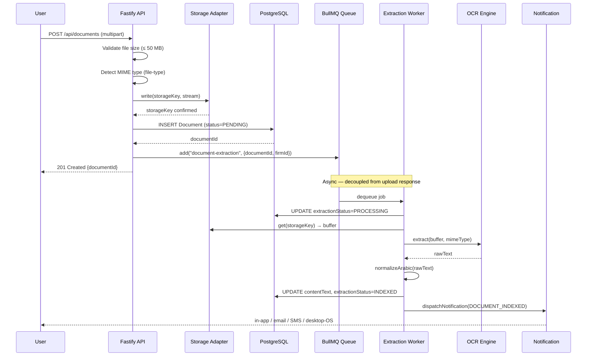

# Document Processing Pipeline

This document traces the full lifecycle of a document in ELMS — from the moment a user uploads a file to the point where it is full-text searchable across the platform.

## Overview



## Phase 1: Upload & Validation

**Route:** `POST /api/documents`
**Plugin:** `@fastify/multipart` (registered in `packages/backend/src/plugins/multipart.ts`)

| Validation | Value | Source |
|------------|-------|--------|
| Max file size | 50 MB (`52 428 800` bytes) | `MAX_UPLOAD_BYTES` env var |
| MIME detection | `file-type` library | Reads first bytes of stream |
| Auth required | Yes — `requireAuth` + `documents:create` permission | |

Files that pass validation are streamed directly to the storage adapter — they are never fully buffered in memory.

## Phase 2: Storage

ELMS supports two storage backends selected by `STORAGE_DRIVER`:

| Driver | Implementation | Config |
|--------|---------------|--------|
| `local` | Write to filesystem | `LOCAL_STORAGE_PATH` (default `./uploads`) |
| `r2` | Cloudflare R2 via `@aws-sdk/client-s3` | `R2_ACCOUNT_ID`, `R2_BUCKET`, `R2_ACCESS_KEY_ID`, `R2_SECRET_ACCESS_KEY`, `R2_PUBLIC_DOMAIN` |

The storage key is a firm-scoped path: `{firmId}/{uuid}.{ext}`. The `IStorageAdapter` interface exposes `put()`, `get()`, and `delete()` — the rest of the system is storage-agnostic.

## Phase 3: Database Record

A `Document` row is created immediately after the file is stored:

```
extractionStatus: PENDING
ocrBackend: TESSERACT | GOOGLE_VISION  (from OCR_BACKEND env var)
contentText: null                       (populated after extraction)
storageKey: "{firmId}/{uuid}.ext"
```

The document is immediately visible in the UI with a "Processing…" indicator. Users do not wait for OCR.

## Phase 4: Extraction Queue (Cloud Mode)

**Queue name:** `document-extraction`
**Backend:** BullMQ + Redis
**Job payload:**
```typescript
interface ExtractionJobData {
  documentId: string;  // UUID
  firmId: string;      // UUID
}
```

**Job options:**
- `attempts: 3` — up to 3 retry attempts
- `backoff: { type: "exponential", delay: 5000 }` — 5 s → 25 s → 125 s between retries
- Dead-letter queue: `document-extraction-dlq` after all retries exhausted

**Worker concurrency:** 3 parallel extractions per worker process.

**Local/Desktop mode:** No Redis; extraction is dispatched in-process after the upload response (queued locally for documents, `setImmediate` for library uploads).

## Phase 5: Text Extraction

`runExtraction.ts` routes by MIME type via the OCR adapter:

| Format | Library | Notes |
|--------|---------|-------|
| PDF (`.pdf`) | `pdf-parse` + embedded-image OCR | Parses selectable text, then OCRs rendered pages in local Tesseract mode and appends OCR text |
| Word (`.docx`) | `mammoth` + embedded-image OCR | Extracts raw text, then OCRs `/word/media/*` images in local Tesseract mode and appends OCR text |
| Images (`.jpg`, `.jpeg`, `.png`, `.tiff`, `.webp`, `.bmp`, `.gif`) | Tesseract.js or Google Vision | Full OCR |

### Embedded-Image OCR Limits (Tesseract local path)

The local Tesseract path applies bounded limits when OCRing embedded images:
- `OCR_EMBEDDED_PDF_MAX_PAGES` (default `2500`)
- `OCR_EMBEDDED_DOCX_MAX_IMAGES` (default `3000`)
- `OCR_EMBEDDED_IMAGE_MAX_BYTES` (default `10,485,76000`)

### OCR Adapter Selection

| `OCR_BACKEND` | Adapter | Requirements |
|---------------|---------|-------------|
| `tesseract` (default) | `TesseractAdapter` — Tesseract.js WASM | No external API; works offline |
| `google_vision` | `GoogleVisionAdapter` — `@google-cloud/vision` | `GOOGLE_VISION_API_KEY` required |

### Arabic Text Normalization

After extraction, `normalizeArabic(rawText)` is applied. This function:
- Strips diacritics (tashkeel) from Arabic text
- Normalises alef variants (أ إ آ → ا)
- Removes tatweel (ـ)

This normalization ensures consistent full-text search regardless of diacritic usage in the original document.

## Phase 6: Index Update

```typescript
await prisma.document.update({
  where: { id: documentId },
  data: { contentText, extractionStatus: "INDEXED" }
});
```

`contentText` is a `@db.Text` column. Full-text search uses PostgreSQL's `websearch_to_tsquery('simple', query)` with the `simple` dictionary to support Arabic (which lacks a dedicated PG text-search dictionary).

**Status transitions:**
```
PENDING → PROCESSING → INDEXED
                      ↘ FAILED (on unrecoverable error)
```

## Phase 7: Post-Index Notification

After successful indexing, a `DOCUMENT_INDEXED` notification is dispatched to the uploading user:

```typescript
await dispatchNotification(env, doc.firmId, doc.uploadedById,
  NotificationType.DOCUMENT_INDEXED, { documentTitle: doc.title });
```

Notification delivery is **best-effort** — errors are silently caught to prevent notification failures from marking the extraction as failed.

## Phase 8: Search

**Route:** `POST /api/search`
**Mechanism:** PostgreSQL full-text search on `Document.contentText`

```sql
SELECT * FROM "Document"
WHERE to_tsvector('simple', content_text) @@ websearch_to_tsquery('simple', $1)
  AND firm_id = $2
  AND deleted_at IS NULL
```

Results are ranked by relevance via `ts_rank`.

## Law Library Extraction

A parallel pipeline exists for library documents:
- Queue: `library-extraction` (handled by `libraryExtractionWorker.ts`)
- Dead-letter queue: `library-extraction-dlq`
- Same OCR adapters and normalization logic
- Updates `LibraryDocument.contentText` and `extractionStatus` (document identity remains the single `title` field)

## Health Check

`GET /api/health` reports queue depth:

```json
{
  "extractionQueue": {
    "depth": 12,
    "status": "ok"
  }
}
```

Status becomes `"degraded"` when queue depth exceeds 100 jobs.

## Related Files

| File | Purpose |
|------|---------|
| [packages/backend/src/jobs/extractionQueue.ts](../../packages/backend/src/jobs/extractionQueue.ts) | BullMQ queue definition and job shape |
| [packages/backend/src/jobs/extractionWorker.ts](../../packages/backend/src/jobs/extractionWorker.ts) | Standalone worker process with DLQ |
| [packages/backend/src/jobs/runExtraction.ts](../../packages/backend/src/jobs/runExtraction.ts) | Core extraction logic and OCR routing |
| [packages/backend/src/jobs/extractionDispatcher.ts](../../packages/backend/src/jobs/extractionDispatcher.ts) | Synchronous dispatch for LOCAL mode |
| [packages/backend/src/storage/](../../packages/backend/src/storage/) | Storage adapter interface and implementations |
| [docs/architecture/09-async-jobs.md](./09-async-jobs.md) | BullMQ architecture overview |

## Source of truth

- `docs/_inventory/source-of-truth.md`
