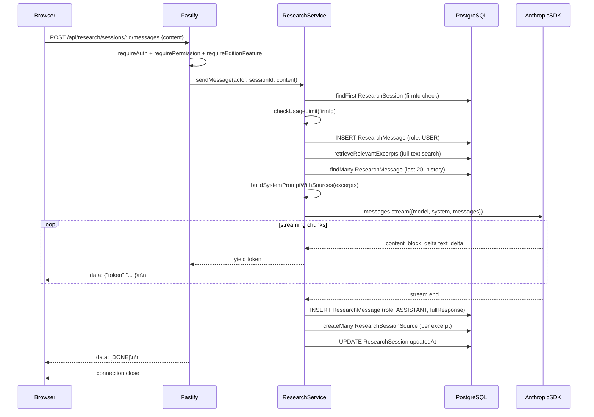

# 08 — AI Research Pipeline

## Overview

The AI research pipeline enables lawyers to conduct natural-language legal research against the firm's law library. It combines PostgreSQL full-text retrieval (RAG) with Anthropic streaming to deliver real-time, cited responses.

Feature gate: `ai_research` edition feature (available on `solo_online`, `local_firm_online`, `enterprise`). Requests missing this feature are rejected at the route level by `requireEditionFeature("ai_research")`.

---

## SSE Streaming Architecture



### SSE Wire Protocol

The route sets these response headers before sending any body:

| Header | Value |
|---|---|
| `Content-Type` | `text/event-stream` |
| `Cache-Control` | `no-cache` |
| `Connection` | `keep-alive` |
| `X-Accel-Buffering` | `no` (disables Nginx proxy buffering) |

Each streamed token is written as:
```
data: {"token":"partial text here"}\n\n
```

When streaming completes normally:
```
data: [DONE]\n\n
```

On error (including `USAGE_LIMIT_EXCEEDED`):
```
data: {"error":"USAGE_LIMIT_EXCEEDED"}\n\n
```

### Frontend Consumption

The browser uses `fetch()` with a `ReadableStream` reader on the response body. Each `data:` line is parsed; `token` values are appended to the message buffer in real time, while `[DONE]` signals the end of the assistant turn.

---

## Retrieval-Augmented Generation (RAG)

### Full-Text Search Query

`retrieval.service.ts` executes a raw SQL query against `library_documents` and `legislation_articles` using PostgreSQL's `websearch_to_tsquery` with the `simple` dictionary (chosen for Arabic compatibility — no language-specific stemming is applied):

```sql
SELECT d.id, a.id, d.title, a.number,
       COALESCE(a.body, d.description, d.title) AS excerpt,
       ts_rank(
         to_tsvector('simple', COALESCE(a.body,'') || ' ' || COALESCE(a.title,'') || ' ' || d.title),
         websearch_to_tsquery('simple', $query)
       ) AS rank
FROM library_documents d
LEFT JOIN legislation_articles a ON a.document_id = d.id
WHERE d.deleted_at IS NULL
  AND (d.scope = 'SYSTEM' OR d.firm_id = $firmId)
  AND <tsvector> @@ websearch_to_tsquery('simple', $query)
ORDER BY rank DESC
LIMIT 5
```

Documents with `scope = 'SYSTEM'` are shared across all tenants (e.g., Egyptian Civil Code). Firm-specific documents are scoped by `firm_id`. The top 5 ranked results (`topK = 5`) are returned, with each excerpt capped at 800 characters.

### Prompt Assembly

The system prompt is a bilingual (Arabic + English) instruction block establishing the assistant's role as an Egyptian/MENA legal research specialist. Retrieved excerpts are injected into a `<sources>` XML block appended to the system prompt:

```
[1] Egyptian Civil Code — Article 163
<excerpt text>

---

[2] <document title>
<excerpt text>
```

The assistant is instructed to cite sources explicitly when responding. If the query returns no relevant documents, the `<sources>` block is omitted and the model relies on its training knowledge.

### Conversation History

The last 20 messages from the session are loaded and passed to the Anthropic API as the `messages` array, preserving multi-turn conversation context. The system prompt (with sources) is passed as the `system` parameter.

---

## Usage Limiting

Usage limiting is enforced at query time inside `checkUsageLimit()`. There is no background cron; the count is computed on every message request.

### Limit Resolution

The effective monthly limit is the lower of:
1. The per-edition policy limit (`editionPolicy.ts`):
   - `solo_online`: 500 messages/month
   - `local_firm_online`: 2,000 messages/month
   - `enterprise`: 0 (unlimited)
2. The `AI_MONTHLY_LIMIT` environment variable override (0 = use policy limit only)

```
effectiveLimit = AI_MONTHLY_LIMIT === 0
  ? policyLimit
  : min(AI_MONTHLY_LIMIT, policyLimit)
```

If `effectiveLimit === 0`, the firm has unlimited access.

### Count Query

```typescript
prisma.researchMessage.count({
  where: {
    role: ResearchRole.USER,          // count user turns, not assistant turns
    session: {
      firmId,
      createdAt: { gte: startOfMonth } // calendar month reset
    }
  }
})
```

Only `USER` role messages are counted, so assistant responses do not inflate the counter. If `used >= limit`, `sendMessage` throws `USAGE_LIMIT_EXCEEDED`, which the route serialises into the SSE stream rather than returning a 4xx status (since headers are already sent).

The `GET /api/research/usage` endpoint exposes `{ allowed, used, limit }` for the frontend to display usage meters.

---

## Session and Message Persistence

### Data Model

| Entity | Key Fields |
|---|---|
| `ResearchSession` | `id`, `firmId`, `userId`, `caseId?`, `title?`, `createdAt`, `updatedAt` |
| `ResearchMessage` | `id`, `sessionId`, `role` (USER \| ASSISTANT), `content`, `createdAt` |
| `ResearchSessionSource` | `id`, `sessionId`, `messageId`, `documentId?`, `articleId?` |

Sessions are optionally linked to a `Case` record for context. A session can contain many messages and each assistant message can reference many sources.

### Write Sequence

1. `POST /api/research/sessions` — creates `ResearchSession`
2. On each user turn: `ResearchMessage` (USER) persisted before calling Anthropic
3. After stream completes: `ResearchMessage` (ASSISTANT) with full response text
4. `ResearchSessionSource` records created for each retrieved excerpt linked to the assistant message
5. `ResearchSession.updatedAt` bumped to surface the session in recency-sorted lists

---

## Citation Chips

`ResearchSessionSource` provides the raw data for "citation chips" rendered in the UI. Each record links one assistant `ResearchMessage` to one source document or legislation article:

```
ResearchMessage (ASSISTANT)
  └─ ResearchSessionSource → LibraryDocument
  └─ ResearchSessionSource → LegislationArticle (within that document)
```

When the frontend loads a session via `GET /api/research/sessions/:sessionId`, the response includes messages with nested `sources`, each hydrating `document` and `article` relations. The UI renders these as interactive chips showing the article number and `LibraryDocument.title`.

---

## Model Configuration

The Anthropic model is read from `env.ANTHROPIC_MODEL` at call time via `loadEnv()`. The default value defined in the environment configuration is `claude-sonnet-4-6`. To override:

```bash
ANTHROPIC_MODEL=claude-opus-4-5 pnpm start
```

The Anthropic client is a singleton instantiated on first call. `max_tokens` is fixed at `4096` per response.

---

## Cost Management

| Control | Mechanism |
|---|---|
| Per-firm monthly cap | `AI_MONTHLY_LIMIT` env var + edition policy limit |
| Unlimited enterprise | `aiMonthlyLimit: 0` in edition policy |
| Context window size | Last 20 messages only; older history is not sent |
| Excerpt cap | 800 characters per retrieved source; top 5 sources only |
| Model selection | Override via `ANTHROPIC_MODEL` to use cheaper models for cost reduction |

Firms without the `ai_research` edition feature cannot create sessions or send messages; they receive HTTP 403 before any Anthropic API call is made.

---

## Related Documents

- [Database — Prisma Schema](../dev/05-database.md) — ResearchSession, ResearchMessage, ResearchSessionSource entity definitions
- [11 — Editions and Licensing](./11-editions-and-licensing.md) — feature gating and `aiMonthlyLimit` by edition
- [07 — Document Pipeline](./07-document-pipeline.md) — LibraryDocument and LegislationArticle indexing (same extraction pipeline)
