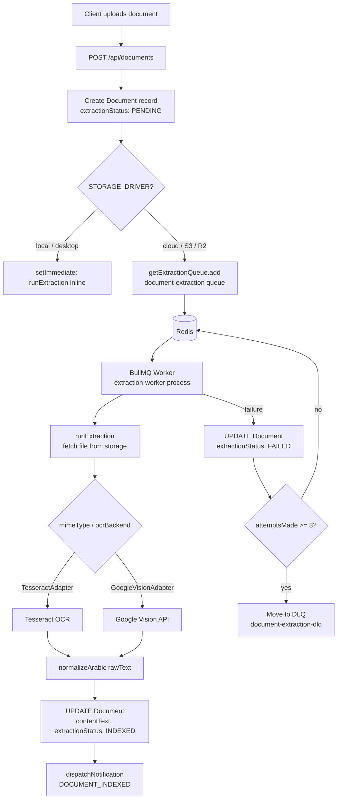

# 09 — Async Jobs (BullMQ)

## Overview

Document text extraction is handled asynchronously to avoid blocking upload responses. In cloud deployments, jobs are queued via BullMQ backed by Redis. In desktop/local deployments, extraction runs inline using `setImmediate` — no Redis or BullMQ is required.

There are two parallel extraction pipelines:

| Pipeline | Queue Name | Purpose |
|---|---|---|
| Case documents | `document-extraction` | Extract text from files attached to cases |
| Law library documents | `library-extraction` (implied) | Extract text from library/legislation uploads |

This document focuses on the case document pipeline (`document-extraction`), which is the primary async job infrastructure. The library extraction pipeline follows the same pattern.

---

## End-to-End Flow



---

## Queue Configuration

**Queue name:** `document-extraction`

**Singleton:** `getExtractionQueue(env)` in `extractionQueue.ts` creates the queue once and reuses it across the process lifetime.

```typescript
// extractionQueue.ts
new Queue<ExtractionJobData>("document-extraction", {
  connection: { url: env.REDIS_URL },
  defaultJobOptions: {
    attempts: 3,
    backoff: { type: "exponential", delay: 5000 }
  }
})
```

**Job payload:**

```typescript
interface ExtractionJobData {
  documentId: string;   // UUID of the Document record
  firmId:     string;   // UUID of the owning firm (for tenant routing)
}
```

Note: The actual file content is never placed in the job payload. The worker fetches the file from storage using the `storageKey` stored on the `Document` record.

---

## Dispatch Logic

`dispatchExtraction()` in `extractionDispatcher.ts` is the single entry point for triggering extraction:

```typescript
if (env.STORAGE_DRIVER === "local") {
  // Desktop mode: run inline after the HTTP response is sent
  setImmediate(() => { void runExtraction(documentId, env, storage); });
} else {
  // Cloud mode: enqueue to BullMQ
  await getExtractionQueue(env).add("extract", { documentId, firmId });
}
```

This means desktop installations never require Redis. The `setImmediate` call defers extraction until after the current event loop tick, so the upload HTTP response is returned to the client first.

---

## Worker Process

The worker runs as a separate Node.js process (`dist/jobs/extractionWorker.js`), independent of the main Fastify server. This allows horizontal scaling by running multiple worker processes against the same Redis queue.

**Worker settings:**

| Setting | Value |
|---|---|
| Queue | `document-extraction` |
| Concurrency | 3 parallel jobs per worker process |
| `removeOnComplete` | Keep last 100 completed jobs |
| `removeOnFail` | Keep last 100 failed jobs |

---

## Extraction Routing Logic

`runExtraction.ts` determines the extraction path based on the document's `ocrBackend` field:

| `ocrBackend` value | Adapter | Use Case |
|---|---|---|
| `GOOGLE_VISION` | `GoogleVisionAdapter` | Cloud OCR, better Arabic/handwriting accuracy |
| anything else | `TesseractAdapter` | Local OCR, works offline |

The adapter receives the raw file buffer and `mimeType`. After extraction, `normalizeArabic()` is applied to the raw text to normalise Arabic Unicode variants before storing in `contentText`.

**Extraction status transitions:**

```
PENDING → PROCESSING → INDEXED   (success)
PENDING → PROCESSING → FAILED    (error)
```

After successful indexing, `dispatchNotification` is called with `NotificationType.DOCUMENT_INDEXED` to notify the uploader. Notification failures are swallowed (`.catch(() => {})`) so they cannot cause the extraction to report failure.

---

## Error Handling and Dead-Letter Queue

BullMQ retries failed jobs up to `attempts: 3` with exponential backoff starting at 5 seconds:

| Attempt | Delay before retry |
|---|---|
| 1 → 2 | 5 s |
| 2 → 3 | 10 s |
| 3 → DLQ | — |

After all retries are exhausted, the worker moves the job to a **dead-letter queue** named `document-extraction-dlq`:

```typescript
worker.on("failed", async (job, err) => {
  if (job && job.attemptsMade >= MAX_ATTEMPTS) {
    await deadLetterQueue.add("failed-extraction", {
      ...job.data,
      originalJobId: job.id,
      error: err.message
    });
  }
});
```

The DLQ retains the last 500 completed and failed entries for manual inspection. The `Document` record is left in `FAILED` status so operators and users can identify documents that require reprocessing.

---

## Health Check Integration

`GET /api/health` reports the queue depth to surface saturation:

```json
{
  "queue": {
    "waiting": 12,
    "active": 3,
    "status": "ok"
  }
}
```

The queue is marked **degraded** if more than 100 jobs are waiting. This threshold signals that worker capacity needs to be increased. If Redis is unavailable, the health check reports the queue as unhealthy.

---

## Cloud vs. Desktop Mode Summary

| Concern | Cloud (STORAGE_DRIVER = s3/r2) | Desktop (STORAGE_DRIVER = local) |
|---|---|---|
| Extraction trigger | BullMQ job enqueued to Redis | `setImmediate` inline call |
| Redis required | Yes | No |
| Worker process | Separate `extractionWorker.js` | Runs in main Fastify process |
| Concurrency | Configurable (multiple worker processes) | Single-threaded, sequential |
| Retry logic | BullMQ exponential backoff | None (single attempt) |
| Dead-letter queue | `document-extraction-dlq` | None |

---

## Monitoring Considerations

- **Queue depth alert**: Monitor `waiting` count via `/api/health`. Alert if consistently above threshold.
- **DLQ monitoring**: Periodically inspect `document-extraction-dlq` for patterns in failed jobs (corrupt files, OCR timeouts, storage connectivity).
- **Worker scaling**: Run additional worker processes (`node dist/jobs/extractionWorker.js`) against the same Redis instance to increase throughput. BullMQ coordinates safely across multiple workers.
- **No built-in dashboard**: A BullMQ dashboard (e.g., Bull Board) can be added by mounting the router in the Fastify application if operational visibility is needed.

---

## Related Documents

- [07 — Document Pipeline](./07-document-pipeline.md) — storage drivers, file retrieval, and OCR integration
- [10 — Notification System](./10-notification-system.md) — `DOCUMENT_INDEXED` notification triggered after extraction
- [13 — Scalability and Limits](./13-scalability-and-limits.md) — BullMQ horizontal scaling path

## Source of truth

- `docs/_inventory/source-of-truth.md`

