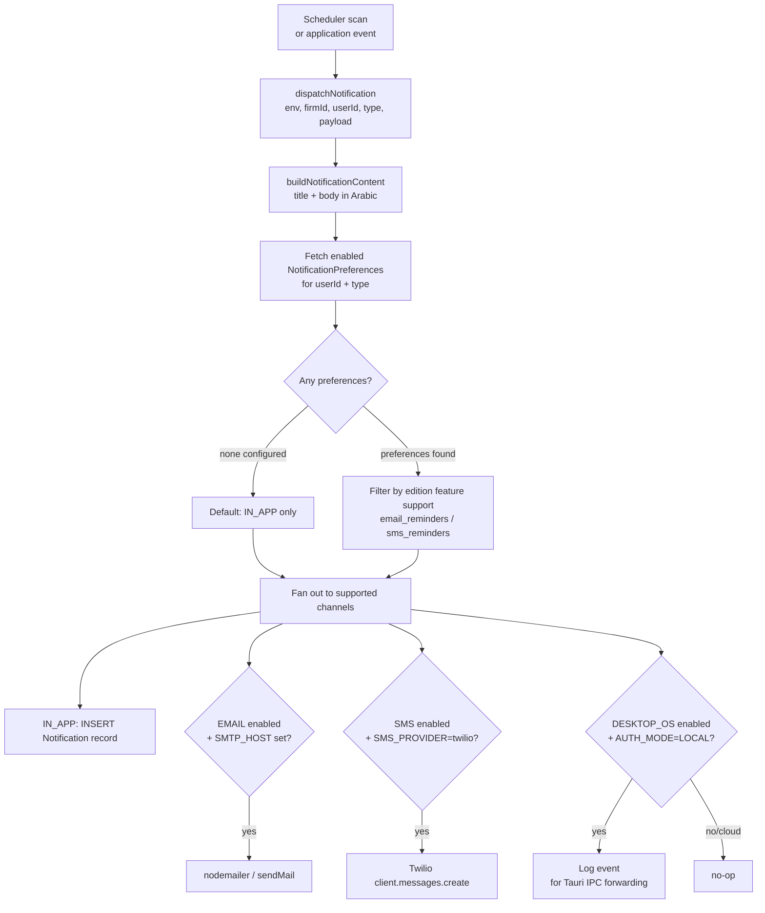

# 10 — Notification System

## Overview

The notification system delivers time-sensitive alerts to firm users via up to five channels: in-app inbox, email, SMS, WhatsApp (Phase 13), and desktop OS native notifications. A preference model allows each user to opt in or out of each channel per notification type.

Notifications are triggered either by **schedulers** (cron-driven reminder scans) or by **application events** (document indexed, research complete, ETA submission result).

---

## Notification Flow



---

## Notification Types

### Shipped (7 types)

| Type | Trigger Condition | Recipients |
|---|---|---|
| `HEARING_7_DAYS` | Hearing session falls within the next 7 days (calendar day window) | All users assigned to the case |
| `HEARING_TOMORROW` | Hearing session falls tomorrow (calendar day window) | All users assigned to the case |
| `HEARING_TODAY` | Hearing session falls today (calendar day window) | All users assigned to the case |
| `TASK_OVERDUE` | Task `dueAt` is in the past, status is not DONE or CANCELLED | The user assigned to the task |
| `INVOICE_OVERDUE` | Invoice `dueDate` is in the past, status is ISSUED or PARTIALLY_PAID | All `firm_admin` role users of the firm |
| `DOCUMENT_INDEXED` | Document extraction completes successfully | The user who uploaded the document |
| `RESEARCH_COMPLETE` | AI research session completes | Session owner (future use) |

Notification titles and bodies are generated in Arabic by `buildNotificationContent()`. Example for `HEARING_TOMORROW`:
- Title: `جلسة غداً`
- Body: `لديك جلسة غداً في قضية: <case title>`

### Planned — Phase 6E

| Type | Trigger Condition | Recipients |
|---|---|---|
| `TASK_DAILY_DIGEST` | Daily job at 08:00 — user has ≥1 overdue tasks | Each user with overdue tasks |

### Planned — Phase 7B

| Type | Trigger Condition | Recipients |
|---|---|---|
| `CHEQUE_MATURITY_DUE` | Cheque `maturityDate` is within 3 days and `status = PENDING` | All `firm_admin` users of the firm |

### Planned — Phase 10A

| Type | Trigger Condition | Recipients |
|---|---|---|
| `PORTAL_APPOINTMENT_REQUEST` | Client submits appointment request via client portal | All `firm_admin` users of the firm |

### Planned — Phase 12

| Type | Trigger Condition | Recipients |
|---|---|---|
| `ETA_SUBMISSION_CONFIRMATION` | ETA API returns success UUID for submitted invoice | Invoice creator |
| `ETA_SUBMISSION_FAILED` | ETA BullMQ worker exhausts all 3 retries | All `firm_admin` users of the firm |

### Planned — Phase 13

| Type | Trigger Condition | Recipients |
|---|---|---|
| `COURT_ROLL_UPDATE` | New session imported from MoJ/State Council portal (Phase 17) | All users assigned to the case |
| `PORTAL_ACTIVITY` | Client views case or downloads document in portal | All `firm_admin` users (optional digest) |

---

## Notification Channels

### IN_APP

Creates a `Notification` record in PostgreSQL via `sendInApp()`. The record stores `firmId`, `userId`, `type`, `title`, `body`, `isRead` (default false), and `createdAt`.

The frontend polls `GET /api/notifications` (paginated, ordered unread-first) and `GET /api/notifications/unread-count`. Users mark notifications read via `PATCH /api/notifications/:id/read` or `PATCH /api/notifications/read-all`.

IN_APP is the fallback channel: if a user has no preferences configured, only IN_APP is used.

### EMAIL

Implemented in `channels/email.ts` using nodemailer. The channel is active only when `SMTP_HOST` is set in the environment. Configuration:

| Env Var | Purpose |
|---|---|
| `SMTP_HOST` | SMTP server hostname (required to enable channel) |
| `SMTP_PORT` | Port number (465 = TLS, others = STARTTLS) |
| `SMTP_USER` | Authentication username (optional) |
| `SMTP_PASS` | Authentication password (optional) |
| `SMTP_FROM` | From address for outbound mail |

Email failures are caught and logged; they never propagate to the caller to avoid breaking the triggering operation. The email channel also requires the firm's edition to have the `email_reminders` feature. Editions without this feature cannot enable email preferences.

### SMS

Implemented in `channels/sms.ts` using the Twilio SDK. Active only when `SMS_PROVIDER=twilio` is set and all three Twilio credentials are present:

| Env Var | Purpose |
|---|---|
| `SMS_PROVIDER` | Must be `twilio` to enable |
| `SMS_ACCOUNT_SID` | Twilio Account SID |
| `SMS_AUTH_TOKEN` | Twilio Auth Token |
| `SMS_FROM_NUMBER` | Twilio phone number or messaging service |

Message format: `<title>: <body>` as a single SMS text. The user's `phone` field must be populated on the `User` record. SMS failures are caught and logged without propagation. Requires the `sms_reminders` edition feature.

### DESKTOP_OS

Implemented in `channels/desktopOs.ts`. This channel is a **no-op in cloud mode** (`AUTH_MODE !== LOCAL`). In desktop (LOCAL) mode, the backend is a Tauri sidecar process; the channel emits an event identified by the constant `DESKTOP_NOTIFY_EVENT = "elms://desktop-notify"`. The Tauri frontend listens for this event and forwards it to the Tauri notification plugin, which triggers a native OS notification.

The current implementation logs the notification to stdout as a placeholder for when a full SSE/WebSocket side channel to the webview is wired up.

### WHATSAPP (Phase 13 — Planned)

Implemented in `channels/whatsapp.ts`. Active only when `WHATSAPP_PROVIDER=meta` is set and all Meta credentials are present.

| Env Var | Purpose |
|---|---|
| `WHATSAPP_PROVIDER` | Must be `meta` to enable |
| `WHATSAPP_PHONE_NUMBER_ID` | Meta phone number ID from Business API |
| `WHATSAPP_ACCESS_TOKEN` | Meta permanent access token |
| `WHATSAPP_TEMPLATE_NAMESPACE` | Template namespace for pre-approved message templates |

**Important constraints:**
- Business-initiated WhatsApp messages (sent outside a 24-hour customer-service window) **must** use pre-approved templates. The channel sends template messages only — free-text is not permitted.
- Each notification type requires a separate approved template submitted to Meta before the channel goes live.
- Requires `whatsapp_notifications` edition feature — available on `solo_online`, `local_firm_online`, and `enterprise` editions only. Not available on desktop-only editions.
- The user's `Client.whatsappNumber` field must be populated. If empty, the channel silently skips.

The WhatsApp channel option appears in `NotificationPreferencesPage.tsx` only when the edition supports it.

---

## NotificationPreference Model

Each preference record is keyed by `(userId, type, channel)` — a compound unique constraint. This allows independent opt-in/out for every combination.

| Field | Type | Description |
|---|---|---|
| `userId` | UUID | The user this preference belongs to |
| `type` | NotificationType | Which notification type |
| `channel` | NotificationChannel | Which delivery channel |
| `enabled` | Boolean | Whether to deliver via this channel |

**Default behaviour:** If no preferences exist for a user+type, the system defaults to `IN_APP` only. This means new users receive in-app notifications without any explicit setup.

**Preference upsert:** `PUT /api/notifications/preferences` accepts `{ type, channel, enabled }`. Attempting to enable EMAIL on an edition without `email_reminders`, SMS without `sms_reminders`, or WHATSAPP without `whatsapp_notifications`, returns HTTP 403.

---

## Reminder Scheduler

The reminder scheduler scans for upcoming hearings, overdue tasks, and overdue invoices daily. It adapts to the deployment mode:

### Desktop Mode (node-cron)

```
cron: "0 8 * * *"  — every day at 08:00 local time
```

Uses `node-cron` for a lightweight in-process schedule. Runs three scans sequentially:
1. `scanHearingReminders` — queries `caseSession` for sessions in 0, 1, and 7 day windows
2. `scanOverdueTasks` — queries `task` where `dueAt < now` and status is active
3. `scanOverdueInvoices` — queries `invoice` where `dueDate < now` and status is ISSUED or PARTIALLY_PAID

### Cloud Mode (BullMQ)

```
repeat cron: "0 8 * * *"  — same daily schedule
Queue: "reminder-scan"
```

Uses a BullMQ repeating job to enqueue the scan. A BullMQ `Worker` with `concurrency: 1` processes the job, calling the same three scan functions. A check at startup prevents duplicate repeating jobs from being enqueued if one already exists.

### Scan Logic Detail

**Hearing reminders:** For each of {today, tomorrow, 7 days from now}, the query finds `caseSession` records whose `sessionDatetime` falls within the midnight-to-midnight window for that day. All users assigned to the case (via active `CaseAssignment` records) receive the notification.

**Task overdue:** All tasks with `dueAt < now`, status not in `[DONE, CANCELLED]`, and a non-null `assignedToId` generate a `TASK_OVERDUE` notification for the assigned user.

**Invoice overdue:** All invoices with `dueDate < now` in `ISSUED` or `PARTIALLY_PAID` status generate `INVOICE_OVERDUE` notifications for all `firm_admin` users of the owing firm.

---

## Edition Lifecycle Scheduler

A separate scheduler in `lifecycle.scheduler.ts` handles trial expiry and firm status transitions. It runs at **02:05** daily (5 minutes after midnight to avoid load collisions with the reminder scheduler at 08:00).

```
cron: "5 2 * * *"  — every day at 02:05
```

It calls `runFirmLifecycleSweep()` from `lifecycle.service.ts`. See [11 — Editions and Licensing](./11-editions-and-licensing.md) for full details of the state transitions triggered by this sweep.

Like the reminder scheduler, it uses `node-cron` in desktop mode and a BullMQ repeating job (`edition-lifecycle-scan` queue) in cloud mode.

---

## Email Provider Decision

The current implementation uses **nodemailer with direct SMTP** exclusively. There is no Resend integration in the current codebase. To use Resend (or any other HTTP-based transactional email service), configure Resend's SMTP relay endpoint as `SMTP_HOST`:

```
SMTP_HOST=smtp.resend.com
SMTP_PORT=465
SMTP_USER=resend
SMTP_PASS=<RESEND_API_KEY>
SMTP_FROM=noreply@yourdomain.com
```

This keeps the integration point in environment configuration rather than code.

---

## Error Isolation

All channel implementations catch and log errors internally. A failure in any single channel (e.g., Twilio API timeout) does not prevent other channels from being dispatched, and does not cause the originating scheduler scan or application event to fail. This is intentional: notification delivery is best-effort and must not affect core write operations.

---

## Related Documents

- [09 — Async Jobs](./09-async-jobs.md) — `DOCUMENT_INDEXED` notification triggered from extraction worker
- [11 — Editions and Licensing](./11-editions-and-licensing.md) — feature gating for `email_reminders` and `sms_reminders`
- [04 — Data Model](./04-data-model.md) — Notification, NotificationPreference schemas
