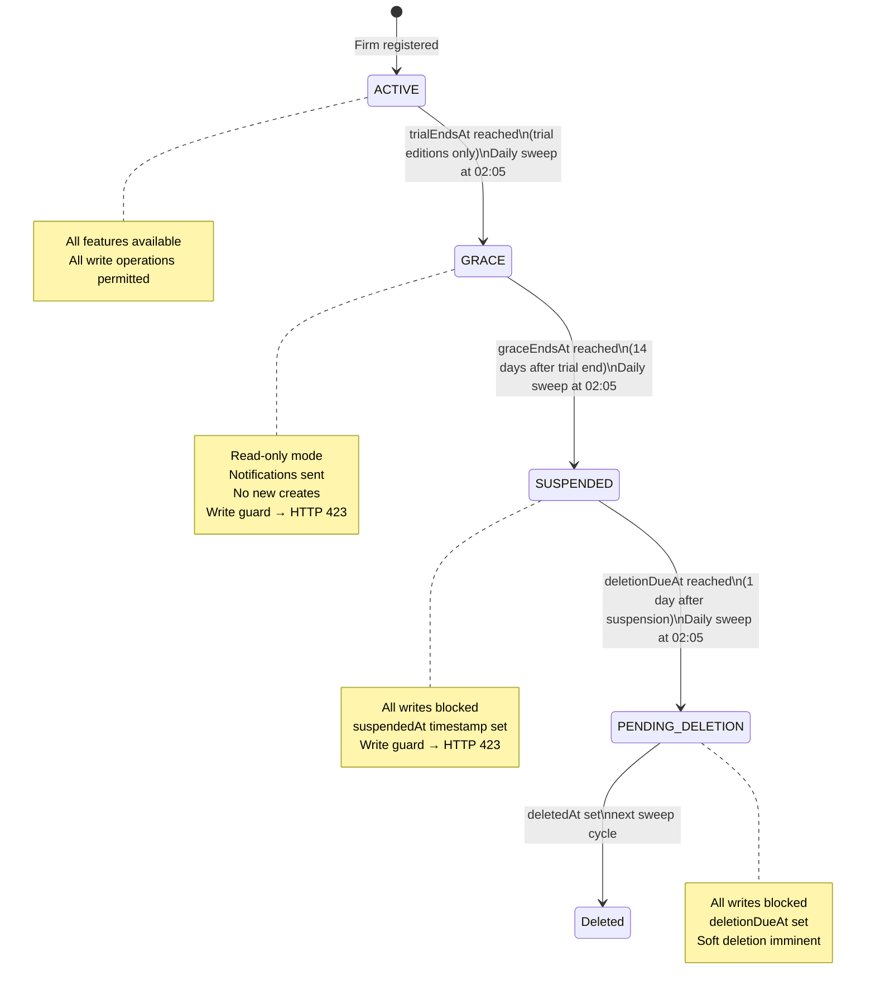

# 11 — Editions and Licensing

## Overview

ELMS uses an edition-based feature model for local/on-prem deployment, serving both individual practitioners and multi-user law firms. The edition system controls feature availability, seat limits, AI usage caps, and trial eligibility. Firm lifecycle state (ACTIVE, GRACE, SUSPENDED, PENDING_DELETION, DATA_DELETION_PENDING, LICENSED) is maintained by a nightly scheduler and enforced by global write guard middleware.

---

## Edition Tiers

Four self-serve editions are defined by the `EditionKey` enum:

### `solo_offline`

| Property | Value |
|---|---|
| Deployment | Desktop only |
| Users (seats) | 1 |
| Features | None of the online feature set |
| AI monthly limit | null (feature not available) |
| Trial | Enabled (30-day trial) |

Designed for a solo practitioner working entirely offline. No internet connectivity is assumed or required. Trial mode allows evaluation before purchase.

### `solo_online`

| Property | Value |
|---|---|
| Deployment | Local |
| Users (seats) | 1 |
| Features | Optional internet-backed features (email, SMS, WhatsApp notifications, Google Calendar sync, Google Vision OCR, AI research, online payments) |
| AI monthly limit | 500 messages/month |
| Trial | Disabled |

Single-user subscription with full online feature access.

### `local_firm_offline`

| Property | Value |
|---|---|
| Deployment | Desktop (LAN) |
| Users (seats) | Unlimited |
| Features | `multi_user` only |
| AI monthly limit | null (feature not available) |
| Trial | Disabled |

Multi-user firm running on a local network without internet. Seats are unlimited but none of the cloud-dependent features (AI, email, OCR, etc.) are available.

### `local_firm_online`

| Property | Value |
|---|---|
| Deployment | Local |
| Users (seats) | Unlimited |
| Features | `multi_user` + all online features |
| AI monthly limit | 2,000 messages/month |
| Trial | Disabled |

The standard multi-user subscription. Combines unlimited seats with the full cloud feature set and a higher AI usage cap.

`enterprise` onboarding is contract/manual and outside self-serve key activation.

### Online Feature Set

The following features are available on all online-capable editions:

- `email_reminders`
- `sms_reminders`
- `whatsapp_notifications`
- `google_calendar_sync`
- `google_vision_ocr`
- `ai_research`
- `payments_online`

`multi_user` is available on all editions except `solo_offline` and `solo_online`.

---

## Firm Lifecycle State Machine



**Note:** The trial lifecycle only applies to editions with `trialEnabled: true`. Currently only `solo_offline` has trial enabled. All other editions start and remain ACTIVE until manually changed or subscription is cancelled.

### Lifecycle Timeline (Trial Edition — `solo_offline`)

```
Day 0  : Firm created → ACTIVE, trialStartedAt = createdAt
Day 30 : trialEndsAt reached → GRACE, 14-day grace period begins; orange blocking banner shown
Day 44 : graceEndsAt reached → DATA_DELETION_PENDING, deletionDueAt = now() + 24h
           TrialCountdownModal appears (full-screen, blocking); auto-export ZIP to OS Desktop begins
Day 45 : deletionDueAt reached → DELETED:
           1. DROP SCHEMA public CASCADE; CREATE SCHEMA public; (Prisma $executeRaw)
           2. rm -rf uploads directory
           3. Prisma connection pool reset
```

Alternatively, if the user enters a valid license key at any point:
```
ANY_STATE → LICENSED (activateLicense endpoint)
```

All date fields (`trialStartedAt`, `trialEndsAt`, `graceEndsAt`, `deletionDueAt`) are lazily computed on first sweep if not already set on the firm record.

---

## Lifecycle Scheduler

The scheduler runs at **02:05 daily** (`cron: "5 2 * * *"`), calling `runFirmLifecycleSweep()`:

1. Load all non-deleted firms from the database
2. For each firm: skip if `trialEnabled` is false for the edition
3. Compute missing date fields (lazy initialisation)
4. Apply state transitions in order: ACTIVE → GRACE → SUSPENDED → PENDING_DELETION → soft-deleted
5. Write only fields that changed (`patch` object accumulation)

The sweep returns a `LifecycleSweepResult` with counts for each transition type, written to the server log.

The scheduler runs locally via `node-cron` in supported deployments.

---

## Feature Gating Middleware

### `requireEditionFeature`

Route-level middleware (`middleware/requireEditionFeature.ts`) reads the actor's `editionKey` from the session and calls `hasEditionFeature(editionKey, feature)`. Returns HTTP 403 if the feature is not in the edition's feature set.

Example: all research routes are guarded with `requireEditionFeature("ai_research")`.

### Seat Limit Enforcement

`assertCanCreateLocalUser()` and `assertCanCreateInvitation()` in `editionPolicy.ts` count active users and pending invitations against the edition's `seatLimit`. Editions with `seatLimit: null` have unlimited seats. Exceeding the limit throws HTTP 403.

### `firmLifecycleWriteGuard`

A global `preHandler` hook registered on the Fastify instance. It intercepts all write methods (POST, PUT, PATCH, DELETE) and returns **HTTP 423 Locked** if the firm's `lifecycleStatus` is `SUSPENDED` or `PENDING_DELETION`:

```typescript
const WRITE_METHODS = new Set(["POST", "PUT", "PATCH", "DELETE"]);
const BLOCKED_STATUSES = new Set([
  FirmLifecycleStatus.SUSPENDED,
  FirmLifecycleStatus.PENDING_DELETION
]);
```

The only exempt write path is `POST /api/auth/logout`. This ensures users can always sign out even when their firm account is blocked.

GRACE status does **not** block writes at the middleware level. However, the scheduler transitions GRACE to SUSPENDED after 14 days, at which point writes are blocked.

---

## RSA Trial Integrity & License Activation (Phase 6A)

### Trial Tamper Detection

The historical design includes a signed `trial.json` integrity file:

```
~/.local/share/com.elms.desktop/trial.json
```

Content:

```json
{
  "firmId": "uuid",
  "trialStartedAt": "2026-01-01T00:00:00Z",
  "signature": "<RSA-SHA256-signature-over-payload>"
}
```

Current backend/runtime wiring does **not** enforce trial tamper checks from desktop startup. `verifyTrialJson()` exists in code as a helper but is not part of the active startup path. Treat this as a planned/legacy mechanism rather than current enforcement.

### License Key Activation

Users purchase a license via the ELMS payment page (opened in the system browser via `Tauri open()`, NOT in the Tauri webview). A license key is emailed after payment.

`activateLicense(firmId, licenseKey)` in `license.service.ts`:

1. Split key string on last `.` into `payloadB64` and `signatureB64`
2. Parse payload JSON from base64 `{ firmId, editionKey, expiresAt }` (optional metadata fields may also be present)
3. Verify RSA-SHA256 signature over `payloadB64` using backend public key
4. Assert firm and edition expectations, and `expiresAt > now()`
5. Hash the raw key with SHA-256 and store in `FirmSettings.licenseKeyHash`
6. Set `FirmSettings.licenseActivatedAt = now()`
7. Transition `Firm.lifecycleStatus → LICENSED` and clear pending edition

A `LICENSED` firm is not subject to the trial scheduler sweep.

### LAN License Grace Mode (Phase 15)

The `licenseGraceGuard`/`LICENSE_GRACE` flow described in earlier phase docs is **not currently wired** in the active Fastify middleware chain. Current access control is enforced by:
- `licenseAccessGuard` (requires activation outside trial-eligible cases)
- `firmLifecycleWriteGuard` (blocks writes for suspended/pending-deletion statuses)

---

## Desktop License

### License Format

The license is an RSA-2048 signed JSON payload:

```json
{
  "firmId": "uuid",
  "editionKey": "solo_offline",
  "expiresAt": "2027-01-01T00:00:00Z"
}
```

The payload is signed using PKCS#1v15 with SHA-256. The signature covers the canonical JSON representation of the payload.

### License File Location

```
~/.local/share/com.elms.desktop/elms.license
```

### Validation

Desktop startup no longer validates this file as part of the Rust bootstrap path. The signed file format remains relevant for backend licensing and commercial fulfillment flows, but the desktop shell now launches without requiring `elms.license` to be present locally.

### License Generation

Licenses are generated using `scripts/generate-license.ts`, which requires the private key (held exclusively by the vendor). The private key is never distributed with the application.

```bash
# Vendor-side only (activation key format for /api/licenses/activate):
tsx scripts/generate-license.ts \
  --firm-id <uuid> \
  --edition-key solo_offline \
  --expires-at 2027-01-01 \
  --private-key apps/desktop/src-tauri/keys/private.pem
```

The script also supports `--legacy-json` for historical `elms.license` compatibility output.

### Key Pair Creation (Vendor-Side)

```bash
# Generate RSA private key
openssl genpkey -algorithm RSA -pkeyopt rsa_keygen_bits:2048 -out private.pem

# Derive matching public key
openssl rsa -pubout -in private.pem -out public.pem
```

Wire the public key into backend verification via:
- `DESKTOP_LICENSE_PUBLIC_KEY` environment variable (raw PEM or base64-encoded PEM).

The private key is vendor-only material and must never be distributed with desktop builds.

---

## Desktop Release Distribution

Desktop releases are currently distributed as full installers only. Linux, Windows, and macOS release workflows build installer artifacts and publish those artifacts directly; the Tauri updater plugin and OTA manifest flow are not part of the active release train.

---

## Business Model Summary

| Model | Edition | Pricing |
|---|---|---|
| Desktop perpetual license | `solo_offline`, `local_firm_offline` | One-time purchase, time-limited license artifact, installer-based upgrades |
| Cloud subscription | `solo_online`, `local_firm_online`, `enterprise` | Monthly/annual SaaS, lifecycle managed by ELMS scheduler |

Cloud subscriptions use the lifecycle state machine for trial, grace, and suspension. Desktop perpetual licenses still rely on licensing metadata, but desktop startup is no longer gated by a local license-file check.

---

## Related Documents

- [01 — System Overview](./01-system-overview.md) — deployment targets
- [10 — Notification System](./10-notification-system.md) — email/SMS reminders gated by edition features
- [08 — AI Research Pipeline](./08-ai-research-pipeline.md) — `ai_research` feature gate and `aiMonthlyLimit`
- [12 — CI/CD Pipeline](./12-cicd-pipeline.md) — installer build workflows and remaining signing secrets

## Source of truth

- `docs/_inventory/source-of-truth.md`
