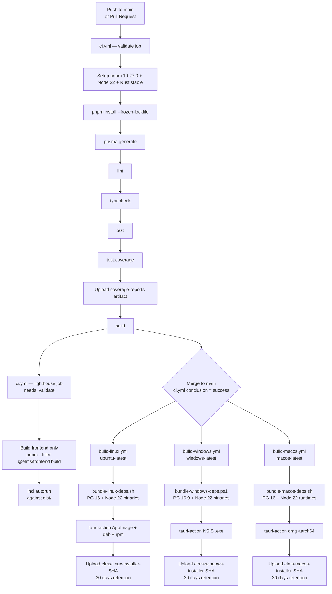

# 12 — CI/CD Pipeline

## Overview

The ELMS CI/CD pipeline is implemented as GitHub Actions workflows. It separates quality validation (which runs on every push and pull request) from desktop release builds (which run only when CI passes on the `main` branch). The three platform build workflows run in parallel and are independent of each other.

---

## Pipeline Architecture



---

## Workflow: `ci.yml`

Triggers: push to `main`, any pull request.

### Job: `validate`

Runs on `ubuntu-latest`. Every step must pass for the job to succeed.

| Step | Command | Purpose |
|---|---|---|
| Setup pnpm | `pnpm/action-setup@v4` version `10.27.0` | Pin package manager version |
| Setup Node | `actions/setup-node@v4` node `22` | Match production runtime |
| Setup Rust | `dtolnay/rust-toolchain@stable` | Required for Tauri compilation checks |
| Install dependencies | `pnpm install --frozen-lockfile` | Reproducible install from lockfile |
| Prisma generate | `pnpm prisma:generate` | Generate Prisma client before TypeScript check |
| Lint | `pnpm lint` | ESLint across all packages |
| Typecheck | `pnpm typecheck` | `tsc --noEmit` across monorepo |
| Test | `pnpm test` | Unit + integration tests |
| Test Coverage | `pnpm test:coverage` | Coverage report generation |
| Upload coverage | `actions/upload-artifact@v4` | Retain coverage reports for review |
| Coverage Summary | `cat coverage-summary.json` | Print summary to job log |
| Build | `pnpm build` | Compile all packages (backend, frontend, shared) |

Coverage artifacts are uploaded with the name `coverage-reports` and include backend, frontend, and shared package coverage directories. They are retained for the default GitHub Actions retention period. The upload step uses `if-no-files-found: warn` so a missing coverage output does not fail the pipeline.

### Job: `lighthouse`

Depends on `validate` (only runs after validate succeeds).

| Step | Purpose |
|---|---|
| Build frontend | `pnpm --filter @elms/frontend build` — produces `packages/frontend/dist/` |
| Install `@lhci/cli@0.14.x` | Lighthouse CI runner |
| `lhci autorun` | Runs Lighthouse against `dist/` using `.lighthouserc.json` configuration |

#### Lighthouse Configuration (`.lighthouserc.json`)

```json
{
  "ci": {
    "collect": {
      "staticDistDir": "./packages/frontend/dist",
      "numberOfRuns": 1,
      "url": ["/index.html"]
    },
    "assert": {
      "preset": "lighthouse:no-pwa",
      "assertions": {
        "categories:performance":      ["warn",  { "minScore": 0.8  }],
        "categories:accessibility":    ["error", { "minScore": 0.9  }],
        "categories:best-practices":   ["warn",  { "minScore": 0.85 }],
        "categories:seo":              ["warn",  { "minScore": 0.8  }]
      }
    },
    "upload": {
      "target": "temporary-public-storage"
    }
  }
}
```

Key points:
- **Accessibility is the only hard-fail threshold** (score < 0.9 → pipeline error). This reflects the legal system's obligation to be accessible.
- Performance, best practices, and SEO are warnings only — they surface in the CI log but do not block the merge.
- `lighthouse:no-pwa` preset excludes PWA audit rules (PWA is an enterprise-only feature, not the default deployment target).
- Results are uploaded to Lighthouse CI temporary public storage for review without requiring a private LHCI server.
- The `LHCI_BUILD_CONTEXT__CURRENT_HASH` environment variable ties the Lighthouse report to the specific git commit.

---

## Workflow: `build-linux.yml`

Triggers: `workflow_run` from `ci` workflow completing successfully on `main`; also `workflow_dispatch` (manual trigger).

Runs on `ubuntu-latest`, timeout 90 minutes.

**Manual inputs (workflow_dispatch):**

| Input | Default | Description |
|---|---|---|
| `pg_version` | `16` | PostgreSQL version to bundle |
| `node_version` | `22.14.0` | Node.js LTS version to bundle |

### Steps

1. **Checkout** — `actions/checkout@v4`
2. **Toolchain setup** — pnpm 10.27.0, Node 22, Rust stable
3. **Rust cache** — `Swatinem/rust-cache@v2` targeting `apps/desktop/src-tauri`
4. **Linux system dependencies** — apt-get installs: `libwebkit2gtk-4.1-dev`, `libssl-dev`, `libayatana-appindicator3-dev`, `librsvg2-dev`, `patchelf`, `rpm`, `fakeroot`, `build-essential`
5. **Install JS dependencies** — `pnpm install --frozen-lockfile`
6. **Prisma generate** — required before TypeScript compilation
7. **Bundle native dependencies** — `bash scripts/bundle-linux-deps.sh` downloads PostgreSQL 16 and Node.js 22 Linux binaries and patches RPATH for portability within the AppImage
8. **Tauri build** — `tauri-apps/tauri-action@v0` with `--bundles appimage,deb,rpm`. The `tauri-action` runner executes `beforeBuildCommand` from `tauri.conf.json`, which builds the backend sidecar and frontend — no separate `pnpm build` step is needed.
9. **Upload artifacts** — AppImage, .deb, and .rpm files uploaded as `elms-linux-installer-<SHA>`, retained 30 days.

**Vite environment variables set during build:**

| Variable | Value |
|---|---|
| `VITE_DESKTOP_SHELL` | `"true"` |
| `VITE_API_BASE_URL` | `"http://127.0.0.1:7854"` |

---

## Workflow: `build-windows.yml`

Triggers: same as build-linux.yml.

Runs on `windows-latest`, timeout 90 minutes.

**Manual inputs:** Same as Linux (`pg_version` default `16.9`, `node_version` default `22.14.0`).

Key differences from Linux:
- Rust target: `x86_64-pc-windows-msvc` (MSVC toolchain, no MinGW)
- Native deps script: `scripts/bundle-windows-deps.ps1 -PgVersion <ver> -NodeVersion <ver>` (PowerShell, downloads EnterpriseDB zip + Node.js zip)
- Tauri build args: `--target x86_64-pc-windows-msvc --bundles nsis`
- Output artifact: NSIS `.exe` installer at `target/x86_64-pc-windows-msvc/release/bundle/nsis/*.exe`
- No system library apt-get step (Windows runner has required toolchain pre-installed)

---

## Workflow: `build-macos.yml`

Triggers: same as build-linux.yml.

Runs on `macos-latest`, timeout 90 minutes.

Key differences:
- Rust targets: `aarch64-apple-darwin,x86_64-apple-darwin` (both loaded for potential universal binary support; the actual build targets `aarch64-apple-darwin`)
- Native deps script: `bash scripts/bundle-macos-deps.sh` downloads the darwin-arm64 Node.js runtime to `apps/desktop/resources/node/node` and bundles Homebrew `postgresql@16` into `apps/desktop/resources/postgres/`
- PostgreSQL uses the same `.layout.env` manifest contract as Linux so the desktop runtime and verifier resolve the packaged `bindir`, `sharedir`, `pkglibdir`, and runtime library directory consistently on both platforms
- The workflow runs `bash scripts/verify-desktop-resources.sh` before invoking Tauri so missing Node.js or PostgreSQL resources fail fast instead of surfacing later inside `beforeBuildCommand`
- Tauri build args: `--target aarch64-apple-darwin --bundles dmg`
- Output artifact: `.dmg` file at `target/aarch64-apple-darwin/release/bundle/dmg/*.dmg`
- **Apple notarization secrets** are consumed from GitHub secrets (required for distribution outside the Mac App Store):

| Secret | Purpose |
|---|---|
| `APPLE_CERTIFICATE` | Developer ID Application certificate (base64) |
| `APPLE_CERTIFICATE_PASSWORD` | Certificate passphrase |
| `APPLE_SIGNING_IDENTITY` | Signing identity string |
| `APPLE_ID` | Apple ID for notarization |
| `APPLE_PASSWORD` | App-specific password |
| `APPLE_TEAM_ID` | Apple Developer Team ID |

---

## Secrets Reference

| Secret | Required by | Purpose |
|---|---|---|
| `APPLE_CERTIFICATE` | build-macos | macOS code signing certificate |
| `APPLE_CERTIFICATE_PASSWORD` | build-macos | Certificate passphrase |
| `APPLE_SIGNING_IDENTITY` | build-macos | Code signing identity |
| `APPLE_ID` | build-macos | Apple ID for notarization |
| `APPLE_PASSWORD` | build-macos | App-specific password |
| `APPLE_TEAM_ID` | build-macos | Apple Developer Team ID |
| `GITHUB_TOKEN` | All build workflows | Used by GitHub Actions for workflow operations and artifact publishing |

---

## Artifact Strategy

| Artifact Name | Contents | Retention |
|---|---|---|
| `coverage-reports` | `packages/*/coverage/**` | GitHub default (90 days) |
| `elms-linux-installer-<SHA>` | `.AppImage`, `.deb`, `.rpm` | 30 days |
| `elms-windows-installer-<SHA>` | `.exe` (NSIS) | 30 days |
| `elms-macos-installer-<SHA>` | `.dmg` | 30 days |

Artifacts are named with the git SHA to allow traceability. Desktop release artifacts should be promoted to a GitHub Release (using `gh release upload`) before they expire.

---

## Triggering a Desktop Release Build

### Automatic (recommended)

Merge a pull request to `main`. Once `ci.yml` completes successfully, all three build workflows trigger automatically via `workflow_run`.

### Manual

Use GitHub's Actions UI or the CLI to dispatch:

```bash
gh workflow run build-linux.yml --ref main
gh workflow run build-windows.yml --ref main
gh workflow run build-macos.yml --ref main
```

Manual dispatch accepts optional `pg_version` and `node_version` inputs to override defaults.

---

## Cloud Deployment

Cloud deployment is handled outside of GitHub Actions by `scripts/deploy-cloud.sh`. This script is intended for manual or webhook-triggered deployment to the production cloud environment. It is not part of the automated GitHub Actions pipeline.

```bash
bash scripts/deploy-cloud.sh
```

Typical cloud deployment steps performed by this script:
1. Pull latest Docker images
2. Run `prisma migrate deploy` against the production database
3. Restart Fastify service containers via Docker Compose or the target orchestrator

---

## Related Documents

- [01 — System Overview](./01-system-overview.md) — Docker cloud vs. Tauri desktop targets
- [11 — Editions and Licensing](./11-editions-and-licensing.md) — desktop licensing model and installer-based release context
- [13 — Scalability and Limits](./13-scalability-and-limits.md) — horizontal scaling of the cloud backend
