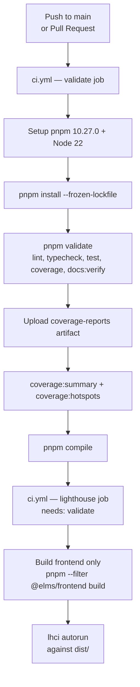

# 12 — CI/CD Pipeline

## Overview

The ELMS CI/CD pipeline is implemented as a single GitHub Actions workflow (`ci.yml`) that runs on every push to `main` and on every pull request. It validates the monorepo (lint, typecheck, tests, coverage, compile) and then runs a Lighthouse accessibility/performance check against the built frontend.

---

## Pipeline Architecture


```mermaid
flowchart TD
    A[Push to main\nor Pull Request] --> B[ci.yml — validate job]
    B --> B1[Setup pnpm 10.27.0 + Node 22]
    B1 --> B2[pnpm install --frozen-lockfile]
    B2 --> B3[pnpm validate\nlint, typecheck, test, coverage, docs:verify]
    B3 --> B4[Upload coverage-reports artifact]
    B4 --> B5[coverage:summary + coverage:hotspots]
    B5 --> B6[pnpm compile]
    B6 --> C[ci.yml — lighthouse job\nneeds: validate]
    C --> C1[Build frontend only\npnpm --filter @elms/frontend build]
    C1 --> C2[lhci autorun\nagainst dist/]
```

---

## Workflow: `ci.yml`

Triggers: push to `main`, any pull request.

### Job: `validate`

Runs on `ubuntu-latest`. Every step must pass for the job to succeed.

| Step | Command | Purpose |
|---|---|---|
| Setup pnpm | `pnpm/action-setup@v4` version `10.27.0` | Pin package manager version |
| Setup Node | `actions/setup-node@v4` node `22` | Match production runtime |
| Install dependencies | `pnpm install --frozen-lockfile` | Reproducible install from lockfile |
| Validate | `pnpm validate` | Lockfile check, prisma generate, lint, lint:unused, i18n:check, typecheck, test, test:coverage, coverage:diff, docs:verify |
| Upload coverage | `actions/upload-artifact@v4` | Retain coverage reports for review |
| Coverage Summary | `pnpm coverage:summary` | Print consolidated package + aggregate summary |
| Coverage Hotspots | `pnpm coverage:hotspots` | Surface top uncovered files in CI logs |
| Compile | `pnpm compile` | Compile all packages (backend, frontend, shared) |

Coverage artifacts are uploaded with the name `coverage-reports` and include backend, frontend, and shared package coverage directories. The upload step uses `if-no-files-found: warn` so a missing coverage output does not fail the pipeline.

### Job: `lighthouse`

Depends on `validate` (only runs after validate succeeds).

| Step | Purpose |
|---|---|
| Build frontend | `pnpm --filter @elms/frontend build` — produces `packages/frontend/dist/` |
| Install `@lhci/cli@0.14.x` | Lighthouse CI runner |
| `lhci autorun` | Runs Lighthouse against `dist/` using `.lighthouserc.json` configuration |

#### Lighthouse Configuration (`.lighthouserc.json`)

```json
{
  "ci": {
    "collect": {
      "staticDistDir": "./packages/frontend/dist",
      "numberOfRuns": 1,
      "url": ["/index.html"]
    },
    "assert": {
      "preset": "lighthouse:no-pwa",
      "assertions": {
        "categories:performance":      ["warn",  { "minScore": 0.8  }],
        "categories:accessibility":    ["error", { "minScore": 0.9  }],
        "categories:best-practices":   ["warn",  { "minScore": 0.85 }],
        "categories:seo":              ["warn",  { "minScore": 0.8  }]
      }
    },
    "upload": {
      "target": "temporary-public-storage"
    }
  }
}
```

Key points:
- **Accessibility is the only hard-fail threshold** (score < 0.9 → pipeline error). This reflects the legal system's obligation to be accessible.
- Performance, best practices, and SEO are warnings only — they surface in the CI log but do not block the merge.
- `lighthouse:no-pwa` preset excludes PWA audit rules.
- Results are uploaded to Lighthouse CI temporary public storage for review without requiring a private LHCI server.
- The `LHCI_BUILD_CONTEXT__CURRENT_HASH` environment variable ties the Lighthouse report to the specific git commit.

---

## Cloud Deployment

Cloud deployment is handled outside of GitHub Actions by `scripts/deploy-cloud.sh`. This script is intended for manual or webhook-triggered deployment to the production cloud environment. It is not part of the automated GitHub Actions pipeline.

```bash
bash scripts/deploy-cloud.sh
```

Typical cloud deployment steps performed by this script:
1. Pull latest Docker images
2. Run `prisma migrate deploy` against the production database
3. Restart Fastify service containers via Docker Compose or the target orchestrator

---

## Related Documents

- [01 — System Overview](./01-system-overview.md)
- [13 — Scalability and Limits](./13-scalability-and-limits.md) — horizontal scaling of the cloud backend

## Source of truth

- `docs/_inventory/source-of-truth.md`
